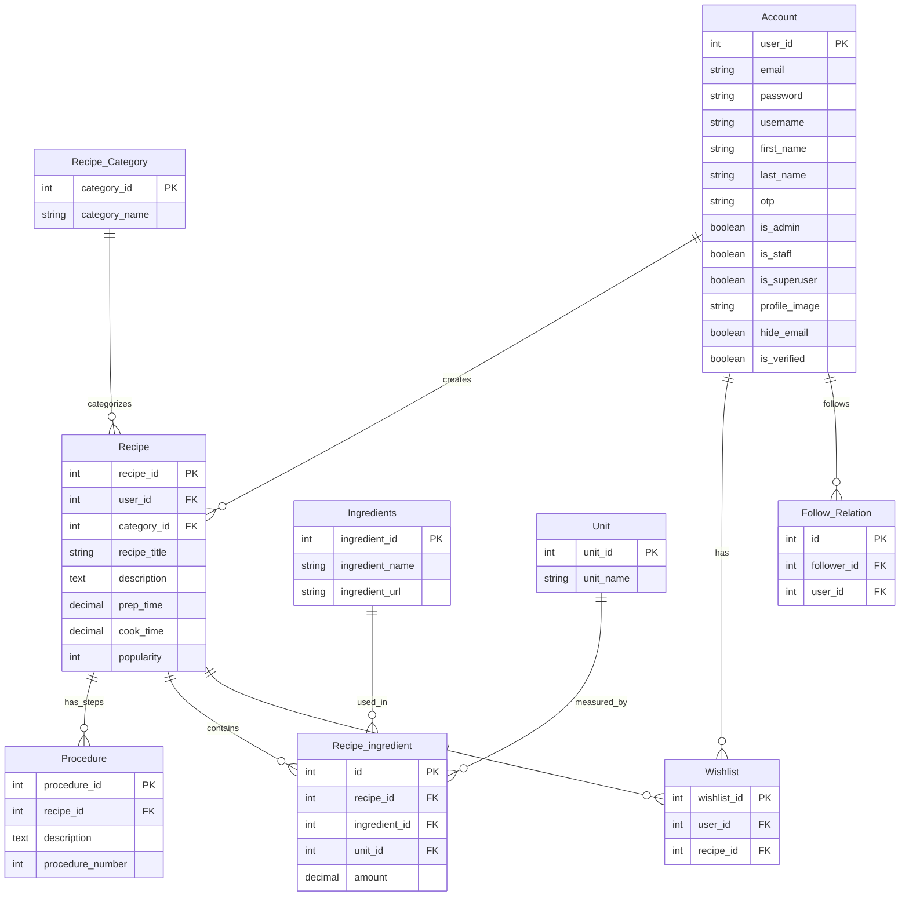

# ConnectFlavour - System Architecture Documentation

## Architecture Overview

ConnectFlavour follows a **three-tier client-server architecture** with clear separation of concerns between presentation, business logic, and data storage layers.

```
┌─────────────────┐    ┌─────────────────┐    ┌─────────────────┐
│   Presentation  │    │  Business Logic │    │   Data Storage  │
│     Layer       │    │      Layer      │    │      Layer      │
│                 │    │                 │    │                 │
│ Flutter Mobile  │◄──►│ Django REST API │◄──►│ MySQL Database  │
│   Application   │    │    Backend      │    │                 │
└─────────────────┘    └─────────────────┘    └─────────────────┘
```

## System Architecture Diagram

Based on the actual architectural design from the project documentation:

### Official ConnectFlavour Architecture

```
┌─────────┐    Act     ┌─────────────┐   Requests   ┌─────────────┐   Queries   ┌─────────────┐
│         │ ────────► │             │ ──────────► │             │ ─────────► │             │
│  User   │           │  Frontend   │             │   Backend   │            │ Databases   │
│         │ ◄──────── │ (Flutter)   │ ◄────────── │ (Python     │ ◄───────── │ (SQL,       │
│         │ Response  │             │    Data     │  Django)    │ Response   │  NoSQL)     │
└─────────┘           └─────────────┘             └─────────────┘            └─────────────┘
```

**Architecture Components:**

- **User Layer**: End-users interacting through mobile interface
- **Frontend Layer**: Flutter-based mobile application handling UI/UX
- **Backend Layer**: Django REST API server managing business logic
- **Database Layer**: MySQL database storing all application data

### Detailed System Flow

```
User Actions → Flutter App → HTTP/HTTPS Requests → Django API Server → Database Queries → MySQL
     ↑                                                     ↓
     └─── JSON Response ← API Response ← Query Results ←───┘
```

## Entity Relationship (ER) Diagram

The database design follows normalized relational database principles with the following key entities:

### Core Entities and Relationships (Based on Actual ER Diagram)

The actual ER diagram from the project shows the following entities and their relationships:

#### Primary Entities:

**1. Account (User Management)**

- Attributes: `user_id`, `email`, `password`, `username`, `first_name`, `last_name`, `otp`, `is_admin`, `is_staff`, `is_superuser`, `profile_image`, `hide_email`, `is_verified`

**2. Recipe Category**

- Attributes: `category_id`, `category_name`

**3. Recipe (Core Entity)**

- Attributes: `recipe_id`, `recipe_title`, `description`, `prep_time`, `cook_time`, `popularity`, `category_id`, `user_id`

**4. Procedure (Recipe Steps)**

- Attributes: `procedure_id`, `recipe_id`, `description`, `procedure_number`

**5. Ingredients (Master List)**

- Attributes: `ingredient_id`, `ingredient_name`, `ingredient_url`

**6. Unit (Measurement Units)**

- Attributes: `unit_id`, `unit_name`

**7. Container_ingredient (Recipe-Ingredient Mapping)**

- Attributes: `ingredient_id`, `ingredient_name`, `ingredient_url`

**8. Recipe_ingredient (Ingredient Details per Recipe)**

- Attributes: `id`, `amount`, `ingredient_id`, `recipe_id`, `unit_id`

**9. Wishlist (User Favorites)**

- Attributes: `wishlist_id`, `recipe_id`, `user_id`

**10. Follow Relation (Social Features)**

- Attributes: `id`, `follower_id`, `user_id`

#### Entity Relationships:

- **Account** ←→ **Recipe** (One user can create many recipes)
- **Recipe_Category** ←→ **Recipe** (One category contains many recipes)
- **Recipe** ←→ **Procedure** (One recipe has many procedure steps)
- **Recipe** ←→ **Recipe_ingredient** (One recipe has many ingredients)
- **Ingredients** ←→ **Recipe_ingredient** (One ingredient used in many recipes)
- **Unit** ←→ **Recipe_ingredient** (One unit used for many ingredient measurements)
- **Account** ←→ **Wishlist** (One user has many wishlist items)
- **Recipe** ←→ **Wishlist** (One recipe can be favorited by many users)
- **Account** ←→ **Follow Relation** (Users can follow other users)



## Domain Model Design

Based on the actual domain model diagram from the project, the system's domain model shows detailed entity relationships with specific attributes and data types:

### Domain Model Structure

The domain model provides a more detailed view of the database structure with specific field types and constraints:

#### Core Domain Entities:

**1. Account (User Management)**

```
account:
├── id: bigint(20) PK
├── password: varchar(128)
├── email: varchar(60)
├── username: varchar(30)
├── first_name: varchar(50)
├── last_name: varchar(50)
├── date_joined: datetime(6)
├── last_login: datetime(6)
├── is_admin: tinyint(1)
├── is_active: tinyint(1)
├── is_staff: tinyint(1)
├── is_superuser: tinyint(1)
├── profile_image: varchar(255)
├── hide_email: tinyint(1)
├── is_verified: tinyint(1)
└── otp: varchar(6)
```

**2. Recipe Category**

```
recipe_category:
├── category_id: int(11) PK
└── category_name: longtext
```

**3. Recipe (Central Entity)**

```
recipe:
├── recipe_id: char(32) PK
├── recipe_title: varchar(35)
├── Description: longtext
├── Prep_time: decimal(3,1)
├── cook_time: decimal(3,1)
├── serving_quantity: int(11)
├── categoryImage: varchar(100)
├── category_id: int(11) FK
└── recipe_user_id: bigint(20) FK
```

**4. Procedure (Recipe Steps)**

```
procedure:
├── procedure_id: int(11) PK
├── description: longtext
├── procedure_number: int UNSIGNED
└── recipe_id: char(32) FK
```

**5. Recipe Ingredient Mapping**

```
recipe_ingredient:
├── id: bigint(20) PK
├── amount: int(11)
├── ingredient_id: int(11) FK
├── recipe_id: char(32) FK
└── unit_id: int(11) FK
```

**6. Container Ingredient**

```
container_ingredient:
├── ingredient_id: int(11) PK
├── ingredient_name: varchar(15)
└── ingredient_url: varchar(100)
```

**7. Unit (Measurements)**

```
unit:
├── unit_id: int(11) PK
└── unit_name: varchar(20)
```

**8. Wishlist (User Favorites)**

```
wishlist:
├── wishlist_id: int(11) PK
├── recipe_id: char(32) FK
└── user_id: bigint(20) FK
```

**9. Follow Relation (Social Features)**

```
Follow Relation:
├── id: bigint(20) PK
├── follower_id: bigint(20) FK
└── user_id: bigint(20) FK
```

### Domain Model Relationships:

- **One-to-Many Relationships**:

  - Account → Recipe (one user creates many recipes)
  - Recipe_Category → Recipe (one category contains many recipes)
  - Recipe → Procedure (one recipe has many steps)
  - Recipe → Recipe_ingredient (one recipe has many ingredients)

- **Many-to-Many Relationships**:

  - Account ↔ Recipe (via Wishlist - users can favorite many recipes)
  - Account ↔ Account (via Follow Relation - users can follow each other)
  - Recipe ↔ Container_ingredient (via Recipe_ingredient - many-to-many with quantities)

- **Supporting Entities**:
  - Unit provides measurement standards for ingredients
  - Container_ingredient serves as a master ingredient catalog

### Database Schema Design

#### User Management Tables

```sql
-- Account table for user authentication and profile
CREATE TABLE Account (
    user_id INT PRIMARY KEY AUTO_INCREMENT,
    username VARCHAR(50) UNIQUE NOT NULL,
    email VARCHAR(100) UNIQUE NOT NULL,
    password_hash VARCHAR(255) NOT NULL,
    first_name VARCHAR(50),
    last_name VARCHAR(50),
    profile_image VARCHAR(255),
    is_active BOOLEAN DEFAULT TRUE,
    is_admin BOOLEAN DEFAULT FALSE,
    created_at TIMESTAMP DEFAULT CURRENT_TIMESTAMP,
    updated_at TIMESTAMP DEFAULT CURRENT_TIMESTAMP ON UPDATE CURRENT_TIMESTAMP
);

-- Session management for authentication tokens
CREATE TABLE User_Sessions (
    session_id VARCHAR(255) PRIMARY KEY,
    user_id INT,
    token VARCHAR(500),
    expires_at TIMESTAMP,
    created_at TIMESTAMP DEFAULT CURRENT_TIMESTAMP,
    FOREIGN KEY (user_id) REFERENCES Account(user_id)
);
```

#### Recipe Management Tables

```sql
-- Recipe categories for organization
CREATE TABLE Recipe_Category (
    category_id INT PRIMARY KEY AUTO_INCREMENT,
    name VARCHAR(100) NOT NULL,
    description TEXT,
    image_url VARCHAR(255),
    sort_order INT DEFAULT 0,
    is_active BOOLEAN DEFAULT TRUE,
    created_at TIMESTAMP DEFAULT CURRENT_TIMESTAMP
);

-- Main recipe table
CREATE TABLE Recipe (
    recipe_id INT PRIMARY KEY AUTO_INCREMENT,
    user_id INT NOT NULL,
    category_id INT NOT NULL,
    title VARCHAR(200) NOT NULL,
    description TEXT,
    image_url VARCHAR(255),
    prep_time_minutes INT,
    cook_time_minutes INT,
    servings INT,
    difficulty_level ENUM('Easy', 'Medium', 'Hard'),
    popularity INT DEFAULT 0,
    is_published BOOLEAN DEFAULT TRUE,
    created_at TIMESTAMP DEFAULT CURRENT_TIMESTAMP,
    updated_at TIMESTAMP DEFAULT CURRENT_TIMESTAMP ON UPDATE CURRENT_TIMESTAMP,
    FOREIGN KEY (user_id) REFERENCES Account(user_id),
    FOREIGN KEY (category_id) REFERENCES Recipe_Category(category_id),
    INDEX idx_category (category_id),
    INDEX idx_user (user_id),
    INDEX idx_popularity (popularity DESC)
);

-- Cooking procedure steps
CREATE TABLE Procedure (
    procedure_id INT PRIMARY KEY AUTO_INCREMENT,
    recipe_id INT NOT NULL,
    step_number INT NOT NULL,
    instruction TEXT NOT NULL,
    image_url VARCHAR(255),
    duration_minutes INT,
    created_at TIMESTAMP DEFAULT CURRENT_TIMESTAMP,
    FOREIGN KEY (recipe_id) REFERENCES Recipe(recipe_id) ON DELETE CASCADE,
    INDEX idx_recipe_step (recipe_id, step_number)
);
```

#### Ingredient Management Tables

```sql
-- Master ingredient list
CREATE TABLE Ingredients (
    ingredient_id INT PRIMARY KEY AUTO_INCREMENT,
    name VARCHAR(100) UNIQUE NOT NULL,
    description TEXT,
    category VARCHAR(50),
    is_active BOOLEAN DEFAULT TRUE,
    created_at TIMESTAMP DEFAULT CURRENT_TIMESTAMP
);

-- Measurement units
CREATE TABLE Unit (
    unit_id INT PRIMARY KEY AUTO_INCREMENT,
    name VARCHAR(50) NOT NULL,
    abbreviation VARCHAR(10),
    type ENUM('Weight', 'Volume', 'Count', 'Length') NOT NULL,
    conversion_factor DECIMAL(10,4) DEFAULT 1.0000,
    is_active BOOLEAN DEFAULT TRUE
);

-- Recipe ingredient relationships with quantities
CREATE TABLE Ingredients_detail (
    detail_id INT PRIMARY KEY AUTO_INCREMENT,
    recipe_id INT NOT NULL,
    ingredient_id INT NOT NULL,
    unit_id INT NOT NULL,
    quantity DECIMAL(10,2) NOT NULL,
    notes TEXT,
    is_optional BOOLEAN DEFAULT FALSE,
    created_at TIMESTAMP DEFAULT CURRENT_TIMESTAMP,
    FOREIGN KEY (recipe_id) REFERENCES Recipe(recipe_id) ON DELETE CASCADE,
    FOREIGN KEY (ingredient_id) REFERENCES Ingredients(ingredient_id),
    FOREIGN KEY (unit_id) REFERENCES Unit(unit_id),
    INDEX idx_recipe (recipe_id),
    INDEX idx_ingredient (ingredient_id)
);
```

#### Social Features Tables

```sql
-- User favorite recipes
CREATE TABLE Wishlist (
    wishlist_id INT PRIMARY KEY AUTO_INCREMENT,
    user_id INT NOT NULL,
    recipe_id INT NOT NULL,
    added_at TIMESTAMP DEFAULT CURRENT_TIMESTAMP,
    FOREIGN KEY (user_id) REFERENCES Account(user_id) ON DELETE CASCADE,
    FOREIGN KEY (recipe_id) REFERENCES Recipe(recipe_id) ON DELETE CASCADE,
    UNIQUE KEY unique_user_recipe (user_id, recipe_id),
    INDEX idx_user (user_id)
);

-- User following system
CREATE TABLE Followers (
    follow_id INT PRIMARY KEY AUTO_INCREMENT,
    follower_id INT NOT NULL,
    following_id INT NOT NULL,
    created_at TIMESTAMP DEFAULT CURRENT_TIMESTAMP,
    FOREIGN KEY (follower_id) REFERENCES Account(user_id) ON DELETE CASCADE,
    FOREIGN KEY (following_id) REFERENCES Account(user_id) ON DELETE CASCADE,
    UNIQUE KEY unique_follow (follower_id, following_id),
    INDEX idx_follower (follower_id),
    INDEX idx_following (following_id)
);
```

## Data Flow Diagrams (DFD)

### Level 0 DFD (Context Diagram)

Based on the actual context diagram from the project, ConnectFlavour is shown as a single high-level process (0.0) with external entities:

```
┌──────────┐                                    ┌──────────┐
│          │  Login Details                     │          │
│          │ ───────────────────►              │          │
│          │  Search, Filter recipe        0.0  │          │
│   User   │ ───────────────────► Connect ────► │  Admin   │
│          │  Can add, edit,     Flavour        │          │
│          │  delete own recipe      │          │          │
│          │ ◄───────────────────────┤          │          │
│          │  Recipe Details         │          │          │
└──────────┘                        │          └──────────┘
                                    │
                              View Information
                              Manage Account
                              Add, edit, delete recipe
```

**Data Flows:**

- **User → System**: Login details, search/filter requests, recipe management
- **System → User**: Recipe details and responses
- **Admin ↔ System**: View information, manage accounts, recipe administration

### Level 1 DFD (System Breakdown)

The actual Level-1 DFD breaks down the main system into core processes:

```
                        ┌─────────────────┐
       User register    │       1.0       │    Admin Login
       or login ────────► Register and    ◄────
                        │     login       │
                        └─────────────────┘
                                │
                ┌───────────────┼───────────────┐
                │               │               │
                ▼               ▼               ▼
      ┌──────────────┐  ┌─────────────────┐  ┌─────────────┐
      │              │  │       1.0       │  │             │
      │     User     │  │    Homepage     │  │   Admin     │
      │              │  │                 │  │             │
      └──────────────┘  └─────────────────┘  └─────────────┘
             │                   │                   │
             │ Search,filter     │ Recipe details    │ Manage Account
             │ recipe            │                   │
             │                   │                   │
             ▼                   ▼                   ▼
      Can add,edit,delete  ┌─────────────────┐  Add,edit,delete recipe
      own recipe           │       1.0       │
                          │     Recipe      │
                          │                 │
                          └─────────────────┘
```

**Core Processes:**

1. **Register and Login (1.0)**: User authentication and admin login processing
2. **Homepage (1.0)**: Central navigation hub and recipe browsing interface
3. **Recipe Management (1.0)**: Complete recipe CRUD operations
4. **User Process**: Personal recipe management and search functionality
5. **Admin Process**: System administration and account management

### Level 2 DFD (Detailed Process Flow)

Detailed data flows within the Recipe Management Process:

```
Input: Recipe Data
    │
    ▼
┌─────────────┐    ┌─────────────┐    ┌─────────────┐
│ Validate    │───►│ Process     │───►│ Store       │
│ Recipe Data │    │ Ingredients │    │ Recipe      │
└─────────────┘    └─────────────┘    └─────────────┘
    │                    │                    │
    ▼                    ▼                    ▼
[User Input]      [Ingredient DB]      [Recipe DB]
                       │
                       ▼
                ┌─────────────┐
                │ Generate    │
                │ Procedures  │
                └─────────────┘
                       │
                       ▼
                [Procedure DB]
```

## Core Algorithms and Business Logic

### Popularity-Based Sorting Algorithm

ConnectFlavour implements a sophisticated sorting algorithm based on recipe popularity to enhance user experience. This algorithm is central to the recommendation system.

**Algorithm Description:**
The system uses a popularity field in the Recipe model that captures engagement metrics. The popularity score is dynamically adjusted based on user interactions:

```python
# Popularity Algorithm Implementation (from project documentation)
class RecipePopularityService:
    @staticmethod
    def update_popularity(recipe_id, interaction_type):
        """
        Update recipe popularity based on user interactions
        - View: +1 point
        - Click: +1 point
        - Save to wishlist: +3 points
        - Share: +5 points
        """
        recipe = Recipe.objects.get(id=recipe_id)

        if interaction_type == 'view':
            recipe.popularity += 1
        elif interaction_type == 'click':
            recipe.popularity += 1
        elif interaction_type == 'save':
            recipe.popularity += 3
        elif interaction_type == 'share':
            recipe.popularity += 5

        recipe.save()

    @staticmethod
    def get_popular_recipes_by_category(category_id=None):
        """
        Retrieve recipes sorted by popularity using Django's order_by function
        """
        queryset = Recipe.objects.filter(is_published=True)

        if category_id:
            queryset = queryset.filter(category_id=category_id)

        # Sort by popularity in descending order
        return queryset.order_by('-popularity', '-created_at')
```

**Key Features:**

- **Dynamic Scoring**: Popularity increases with user engagement
- **Weighted Interactions**: Different actions have different weight values
- **Category-Specific Sorting**: Popular recipes within specific categories
- **Recency Factor**: Recently created recipes get visibility boost
- **Performance Optimized**: Uses Django ORM's efficient sorting mechanisms

### Recipe Recommendation System

The system implements a content-based recommendation approach:

```python
# API Implementation (from project source code)
class ChecklistAPI(APIView):
    permission_classes = [IsAuthenticated, IsOwner]
    serializers_class = RecipeItemSerializer

    def get(self, request, format=None):
        category_choice = request.query_params.get('category', None)
        uid_choice = request.query_params.get('id', None)
        user_recipe = request.query_params.get('user', None)
        choice_type = request.query_params.get('usertype', None)

        if category_choice:
            # Filter recipes by category, excluding user's own recipes
            data = Recipe.objects.filter(
                Q(category_id=category_choice) &
                ~Q(recipe_user_id=request.user)
            ).order_by('-popularity')

        elif uid_choice and user_recipe:
            # Get recipes from specific user, excluding specified recipe
            data = Recipe.objects.filter(
                Q(recipe_user_id=user_recipe) &
                ~Q(recipe_id=uid_choice)
            )

        elif choice_type == "self":
            # Get user's own recipes
            data = Recipe.objects.filter(
                Q(recipe_user_id=request.user)
            )

        elif choice_type == "other":
            # Get recipes from other users
            data = Recipe.objects.filter(
                ~Q(recipe_user_id=request.user)
            ).order_by('-popularity')

        return Response(serializer.data)
```

## Physical Architecture (Deployment)

### Development Environment

```
┌─────────────────────────────────────────────────────────┐
│                Development Environment                   │
├─────────────────────────────────────────────────────────┤
│ ┌─────────────┐  ┌─────────────┐  ┌─────────────────┐  │
│ │   Flutter   │  │   Django    │  │     MySQL       │  │
│ │Development  │  │Development  │  │   Database      │  │
│ │   Server    │  │   Server    │  │                 │  │
│ │ (Localhost  │  │(Localhost   │  │  (Localhost     │  │
│ │   :3000)    │  │  :8000)     │  │   :3306)        │  │
│ └─────────────┘  └─────────────┘  └─────────────────┘  │
└─────────────────────────────────────────────────────────┘
```

### Production Environment (Recommended)

```
┌─────────────────────────────────────────────────────────┐
│                 Production Environment                   │
├─────────────────────────────────────────────────────────┤
│        ┌─────────────┐                                  │
│        │  Load       │                                  │
│        │ Balancer    │                                  │
│        │ (Nginx)     │                                  │
│        └─────────────┘                                  │
│               │                                          │
│         ┌─────▼─────┐  ┌─────────────┐                 │
│         │  Web      │  │   Mobile    │                 │
│         │ Server    │  │App Stores   │                 │
│         │(Django+   │  │(Play Store, │                 │
│         │Gunicorn)  │  │ App Store)  │                 │
│         └───────────┘  └─────────────┘                 │
│               │                                          │
│         ┌─────▼─────┐  ┌─────────────┐                 │
│         │ Database  │  │   Redis     │                 │
│         │ Server    │  │   Cache     │                 │
│         │ (MySQL)   │  │   Server    │                 │
│         └───────────┘  └─────────────┘                 │
└─────────────────────────────────────────────────────────┘
```

## API Architecture

### RESTful API Design

The backend follows REST principles with clear resource-based URLs:

```
Authentication Endpoints:
POST /api/auth/register/     - User registration
POST /api/auth/login/        - User login
POST /api/auth/logout/       - User logout
POST /api/auth/refresh/      - Token refresh

Recipe Endpoints:
GET    /api/recipes/                    - List all recipes
POST   /api/recipes/                    - Create new recipe
GET    /api/recipes/{id}/               - Get recipe details
PUT    /api/recipes/{id}/               - Update recipe
DELETE /api/recipes/{id}/               - Delete recipe
GET    /api/recipes/category/{cat_id}/  - Recipes by category
GET    /api/recipes/search/             - Search recipes
GET    /api/recipes/popular/            - Popular recipes

Category Endpoints:
GET /api/categories/         - List all categories
GET /api/categories/{id}/    - Get category details

User Endpoints:
GET    /api/users/profile/           - Get user profile
PUT    /api/users/profile/           - Update user profile
GET    /api/users/{id}/recipes/      - User's recipes
POST   /api/users/follow/{id}/       - Follow user
DELETE /api/users/unfollow/{id}/     - Unfollow user

Wishlist Endpoints:
GET    /api/wishlist/                - Get user's wishlist
POST   /api/wishlist/add/            - Add recipe to wishlist
DELETE /api/wishlist/remove/{id}/    - Remove from wishlist
```

## Security Architecture

### Authentication Flow

```
┌─────────────┐    ┌─────────────┐    ┌─────────────┐
│   Mobile    │    │   Django    │    │   Database  │
│     App     │    │   Backend   │    │             │
└─────────────┘    └─────────────┘    └─────────────┘
       │                  │                  │
       │ 1. Login Request │                  │
       ├─────────────────►│                  │
       │                  │ 2. Verify User   │
       │                  ├─────────────────►│
       │                  │ 3. User Data     │
       │                  │◄─────────────────┤
       │ 4. JWT Token     │                  │
       │◄─────────────────┤                  │
       │                  │                  │
       │ 5. API Requests  │                  │
       │  (with token)    │                  │
       ├─────────────────►│                  │
       │                  │ 6. Validate Token│
       │                  │ 7. Process Request
       │                  ├─────────────────►│
       │ 8. Response      │ 8. Data Response │
       │◄─────────────────┤◄─────────────────┤
```

### Data Security Measures

- **Input Validation** - All user inputs validated and sanitized
- **SQL Injection Prevention** - Django ORM protects against SQL injection
- **Cross-Site Scripting (XSS) Protection** - Built-in Django security
- **Cross-Site Request Forgery (CSRF) Protection** - CSRF tokens for forms
- **Password Security** - Hashed passwords using Django's built-in functions
- **Token-based Authentication** - JWT tokens for stateless authentication

## Performance Architecture

### Caching Strategy

```
┌─────────────┐    ┌─────────────┐    ┌─────────────┐
│   Mobile    │    │   Redis     │    │   Django    │
│    Cache    │    │   Cache     │    │   Backend   │
│  (Local)    │    │ (Session)   │    │             │
└─────────────┘    └─────────────┘    └─────────────┘
       │                  │                  │
   Recipe Data        Session Data      Business Logic
   Images Cache       Popular Recipes   Database Queries
   User Preferences   Category Cache    API Processing
```

### Database Optimization

- **Indexing Strategy** - Primary keys, foreign keys, and search fields indexed
- **Query Optimization** - Efficient ORM queries with select_related and prefetch_related
- **Connection Pooling** - Database connection management
- **Pagination** - Large dataset handling with pagination
- **Full-text Search** - MySQL full-text search for recipe content

## Scalability Considerations

### Horizontal Scaling Options

1. **Database Scaling** - Master-slave replication for read scaling
2. **Application Scaling** - Multiple Django instances behind load balancer
3. **Cache Scaling** - Redis cluster for distributed caching
4. **CDN Integration** - Content delivery network for static assets
5. **Microservices Migration** - Future migration to microservices architecture

### Monitoring and Logging

```
Application Metrics:
- API Response times
- Database query performance
- User engagement metrics
- Error rates and exceptions

System Metrics:
- Server resource utilization
- Database connection pools
- Cache hit rates
- Network latency
```

---

_This architecture documentation is based on the system design described in the ConnectFlavour project report, enhanced with production-ready considerations and best practices._
